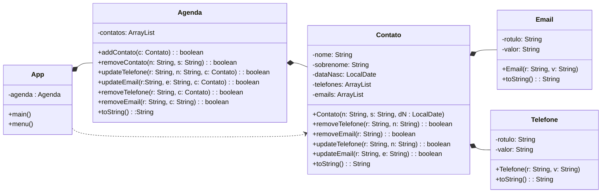

# Diagrama de classes UML

```mermaid
classDiagram
    direction LR

    class App{
        -agenda : Agenda
        +main()
        +menu()
    }
    class Agenda{
        -contatos: ArrayList<Contatos>
        +addContato(c: Contato): boolean
        +removeContato(n: String, s: String): boolean
        +updateTelefone(r: String, n: String, c: Contato): boolean
        +updateEmail(r:String, e: String, c: Contato): boolean
        +removeTelefone(r: String, c: Contato): boolean
        +removeEmail(r: String, c: String): boolean
        +toString():String
    }
    class Contato{
        -nome: String
        -sobrenome: String
        -dataNasc: LocalDate
        -telefones: ArrayList<Telefone>
        -emails: ArrayList<Email>
        +Contato(n: String, s: String, dN : LocalDate)
        +removeTelefone(r: String, n: String): boolean
        +removeEmail(r: String) : boolean
        +updateTelefone(r: String, n: String) : boolean
        +updateEmail(r: String, e: String) : boolean
        +toString(): String
    }
    class Email{
        -rotulo: String
        -valor: String 
        +Email (r: String, v: String)
        +toString(): String
    }
    class Telefone{
        -rotulo: String
        -valor: String
        +Telefone(r: String, v: String)
        +toString(): String
    }
    Contato <.. App
    App    *-- Agenda
    Agenda *-- Contato
    Contato *-- Email
    Contato *-- Telefone
    

```