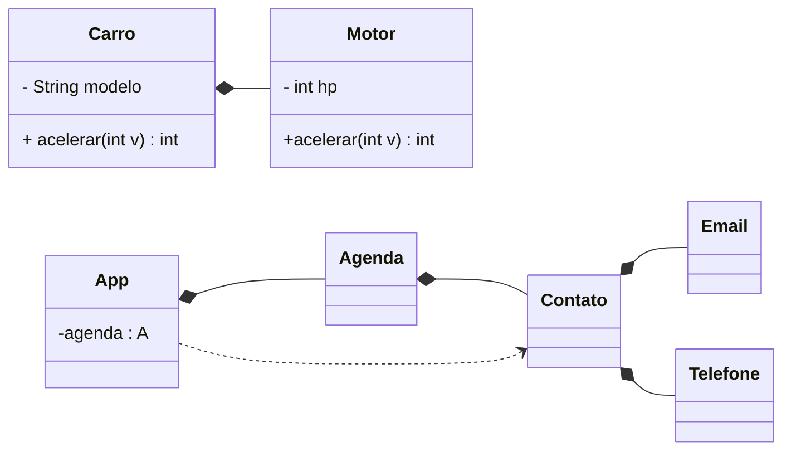

# Diagrama de classes UML

```mermaid
classDiagram
    direction LR
    
    class Carro{
        - String modelo
        + acelerar (int v) int
    }
    
    class Motor{
        - int hp
        +acelerar (int v) int
    }
    
    Carro *-- Motor

    class App{
        -agenda : A
    }
    class Agenda{

    }
    class Contato{
        
    }
    class Email{
        
    }
    class Telefone{

    }
    Contato <.. App
    App    *-- Agenda
    Agenda *-- Contato
    Contato *-- Email
    Contato *-- Telefone
    

```