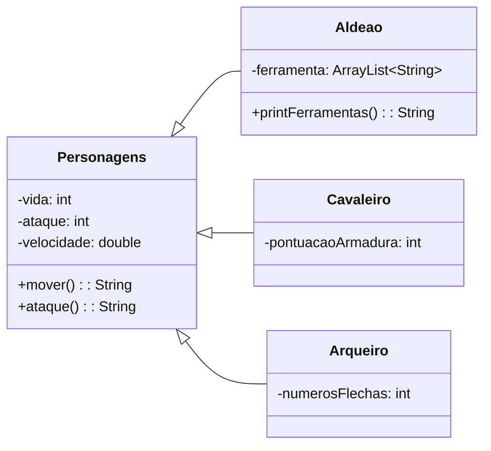

# Diagrama de classes UML

```mermaid
classDiagram
    direction LR

    
    class Personagens{
        -vida: int
        -ataque: int
        -velocidade: double
        +mover() : String
        +ataque(): String
        
    }
    class Aldeao{
        -ferramenta: ArrayList~String~
        +printFerramentas(): String

    }
    class Arqueiro{
        -numerosFlechas: int

    }
    class Cavaleiro{
        -pontuacaoArmadura: int
    }
    
    Personagens <|-- Aldeao
    Personagens <|-- Cavaleiro
    Personagens <|-- Arqueiro
    
```