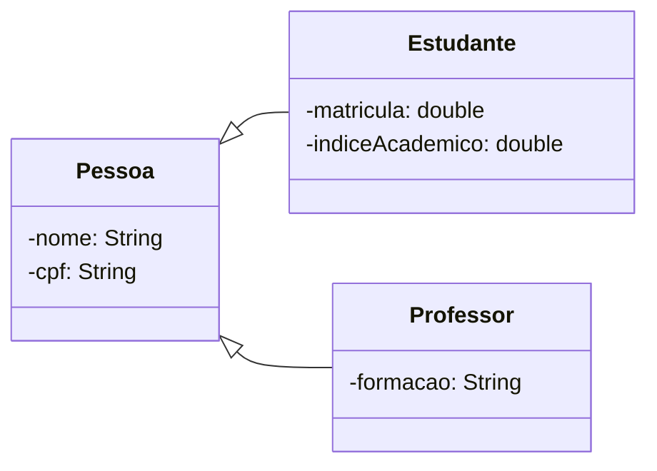
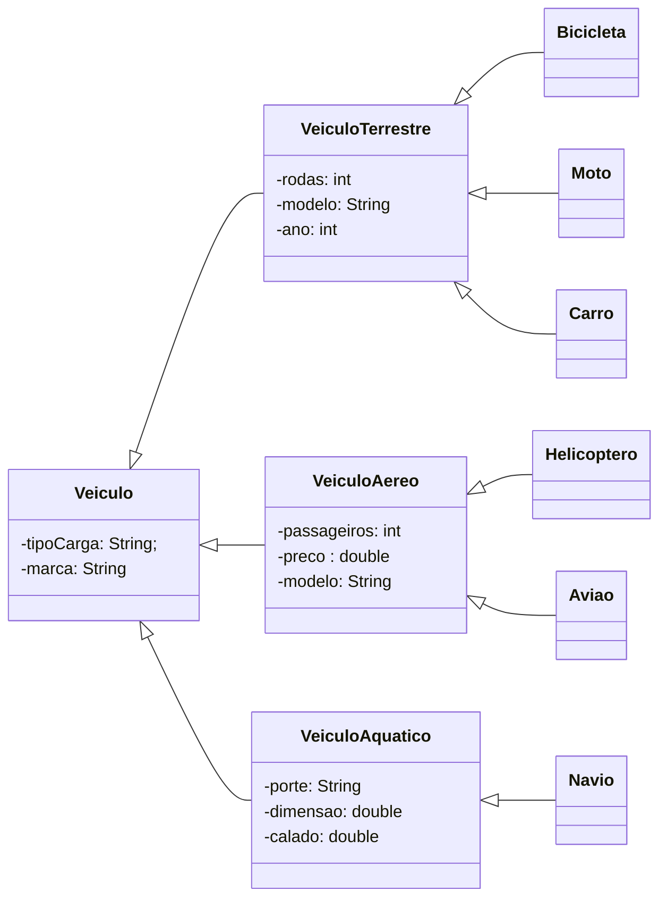

# Diagrama de classes UML

```mermaid
classDiagram
    direction LR

    class Pessoa{
        -nome: String
        -cpf: String

    }
    class Estudante{
        -matricula: double
        -indiceAcademico: double

    }
    class Professor{
        -formacao: String
    }

    Pessoa <|-- Estudante
    Pessoa <|-- Professor
    
```
    

```mermaid
classDiagram
    direction LR
    
    Veiculo <|-- VeiculoTerrestre 
    Veiculo <|-- VeiculoAereo
    Veiculo <|-- VeiculoAquatico
    VeiculoTerrestre <|-- Bicicleta
    VeiculoTerrestre <|-- Moto
    VeiculoTerrestre <|-- Carro
    VeiculoAquatico <|-- Navio
    VeiculoAereo <|-- Helicoptero
    VeiculoAereo <|-- Aviao
    
    
 

    class Veiculo{
        -tipoCarga: String;
        -marca: String
        
    }
    class VeiculoTerrestre{
        -rodas: int
        -modelo: String
        -ano: int
    }
    class VeiculoAereo{
        -passageiros: int
        -preco : double
        -modelo: String
    }
    class VeiculoAquatico{
        -porte: String
        -dimensao: double
        -calado: double
    }
    class Bicicleta{

    }
    class Carro{

    }
    class Moto{

    }
    class Navio{

    }
    class Aviao{

    }
    class Helicoptero{

    }
    

```

```mermaid
classDiagram
    direction LR

```