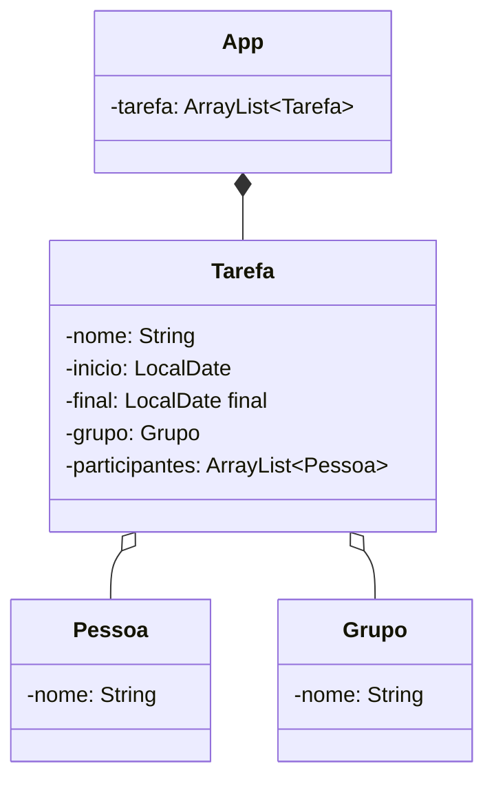

```mermaid

classDiagram
    App *-- Tarefa
    Tarefa o-- Pessoa
    Tarefa o-- Grupo

    class App{
        -tarefa: ArrayList~Tarefa~
    }
    class Tarefa{
         -nome: String
         -inicio: LocalDate
         -final: LocalDate final
         -grupo: Grupo
         -participantes: ArrayList~Pessoa~
    }
    class Pessoa{
        -nome: String
    }
    class Grupo{
        -nome: String
    }
```