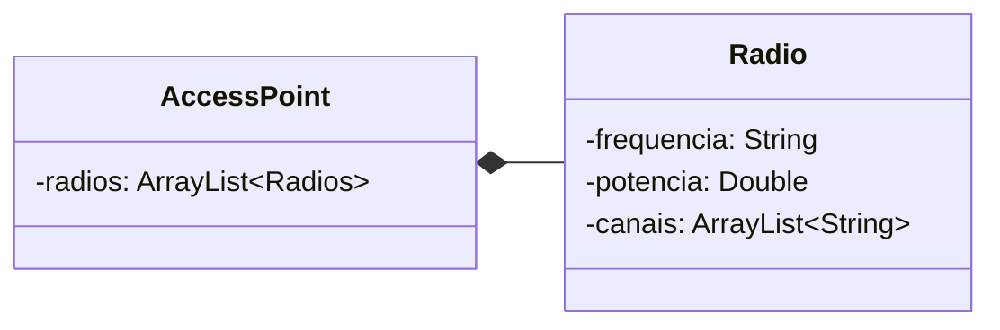
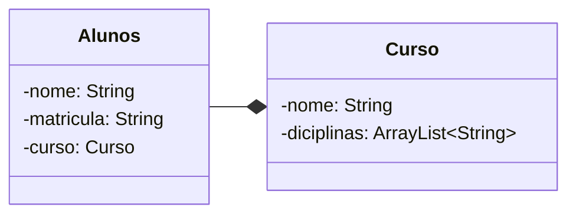

# Diagrama de classes UML

## Modelagem 1 - 
Faça um diagrama de classes UML para representar um ponto de acesso
sem fio (Access Point – AP). O AP pode possuir rádios de 2.4Ghz e de 5Ghz.
Cada rádio possui uma potência e canais de operação

## Modelagem 2 -
Faça um diagrama de classes UML para representar alunos, disciplinas e
cursos. Um aluno pode estar matriculado em um único curso e fazer 1 ou
mais disciplinas. Um curso pode conter uma ou mais disciplinas. Uma
disciplina pode ser ofertada por 1 ou mais cursos.
